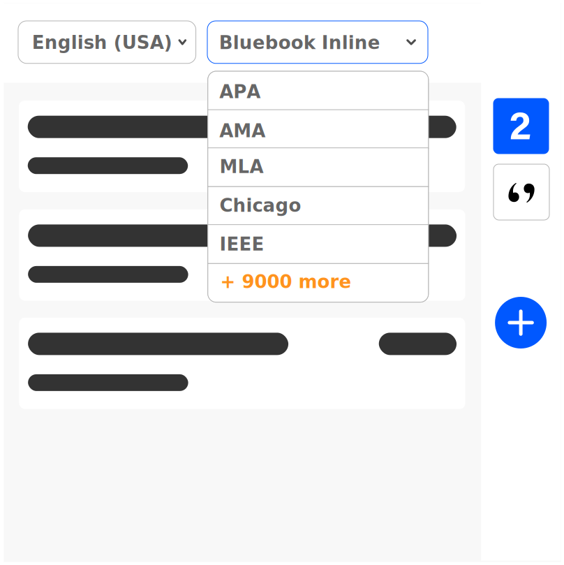

# Bluebook Inline

When you 're tasked by using "Bluebook Inline" (AAA) for your term paper, bachelor 's, or master 's thesis to create citations and bibliographies.
Manually entering bibliographies and in-text citations can be time-consuming and error-prone. And while we will try to present you some examples on how to do the referencing by hand, at CiteDrive, we do it all for you.

## Details  Bluebook Inline
* Title: Bluebook Inline
* Short Title (Id): AAA)
* **fields:** law

## Reference tools?
### CiteDrive - citedrive.com
** How can CiteDrive help you with Bluebook Inline? **
We designed CiteDrive from the ground up to be as simple and easy to use as possible - you 've got more important things to do than to worry about bibliographies. Simply with CiteDrive, you create a library for your work. Collect all the items you need to cite, and we do the rest. Click on "create bibliography" when you 're ready. We then create citations and the bibliography in Bluebook Inline for you. For in-text-citations, simply select one or multiple items and press on the "cite"-button. Add collaborators to your project if you are working with other students on your project. Anyone can make changes at any time.

### Zotero - zotero.com

coming soon

## Example items

This table demonstrates how you can use these elements to create proper in-text citations and the bibliography. The first element has only one author, the second has two, and the third has three. Also, note that the second element has no date.

<table>
  <tr>
   <td>Number
   </td>
   <td>Title
   </td>
   <td>Type
   </td>
   <td>Authors
   </td>
   <td>Date
   </td>
   <td>Journal
   </td>
   <td>Pages
   </td>
   <td>Volume
   </td>
   <td>Issue
   </td>
   <td>Access Date
   </td>
  </tr>
  <tr>
   <td>1
   </td>
   <td>Title #1
   </td>
   <td>Article in Journal
   </td>
   <td><strong>Jane Doe</strong>
   </td>
   <td>2008
   </td>
   <td>XYZ
   </td>
   <td>1-999
   </td>
   <td>3
   </td>
   <td>2
   </td>
   <td>--
   </td>
  </tr>
  <tr>
   <td>
2
   </td>
   <td>Title #2
   </td>
   <td>Website
   </td>
   <td><strong>Jane Doe, </strong>John Doe
   </td>
   <td>---
   </td>
   <td>---
   </td>
   <td>---
   </td>
   <td>4
   </td>
   <td>---
   </td>
   <td>2020-05-01
   </td>
  </tr>
  <tr>
   <td>3
   </td>
   <td>Title #3
   </td>
   <td>Article in Journal
   </td>
   <td>Jane Doe, John Doe, Monty Python
   </td>
   <td>1988
   </td>
   <td>ABC
   </td>
   <td>---
   </td>
   <td>---
   </td>
   <td>16
   </td>
   <td>---
   </td>
  </tr>
</table>

## How do I cite in  Bluebook Inline?

Let us produce some example in-text-citations:

:::note Citations

This sentence refers to the first item from the table. Jane Doe, <i>Title #1</i>, 3 Imaginary Journal 1–999 (2008) This, in turn, refers to the second Title #2, https://example.com/ (last visited May 1, 2021)
and then to the third.  Jane Doe et al., <i>Title #3</i>, ABC 
This paragraph demonstrates the clustering of citations by citing the first and third item. Doe; Doe et al.

:::

## How do I create a bibliography in Bluebook Inline?

This bibliography contains all items from the sample table. Please note that these examples in the table consist only of articles. Other source types may require different handling, such as web pages that expect an access date, or movies, music tracks etc.

While we would like to show a few such concrete examples in the future - this series of articles is in fact in progress - we would like to point out that CiteDrive already features them.

:::note Bibliography

:::

        