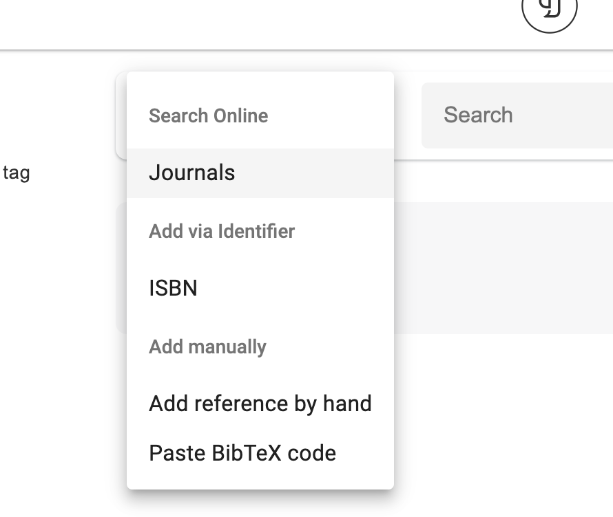
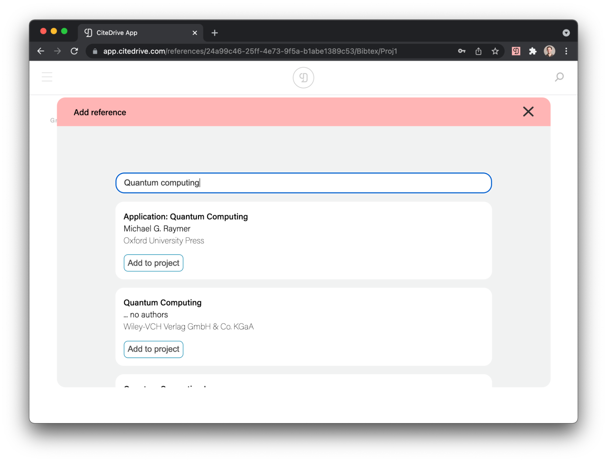
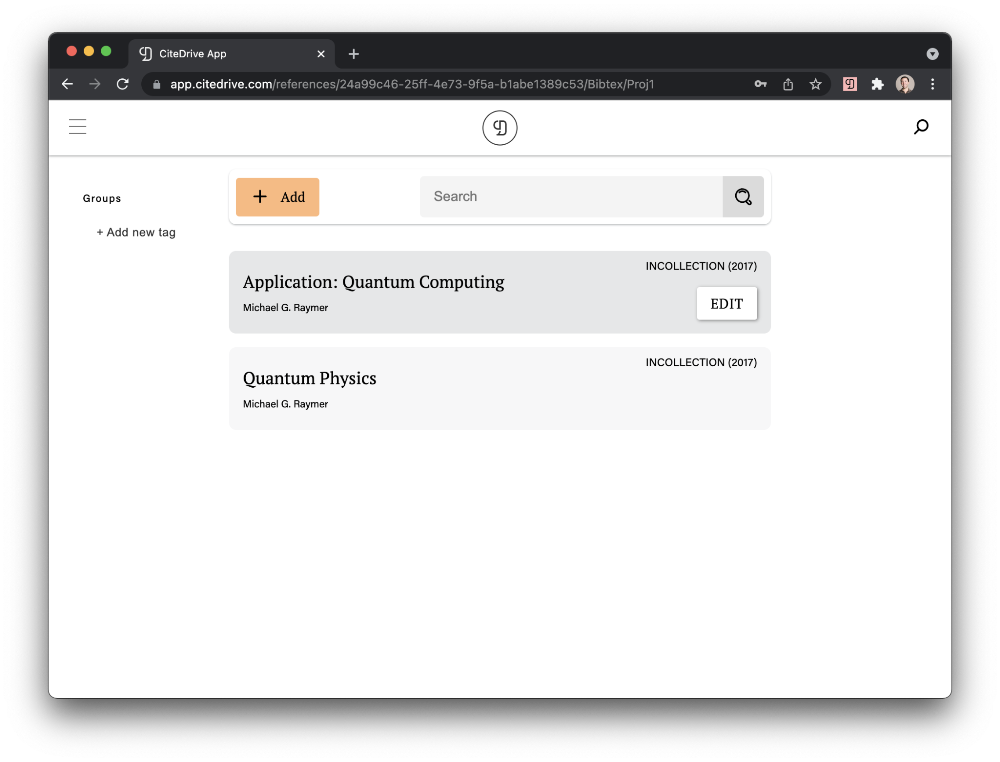

# Adding References to Journals

CiteDrive supports collecting and adding references to your projects in a variety of ways. One of the fastest and easiest paths is to use the CiteDrive Companion Browser Extension but you can also do article searches or ISBN lookups within the app, in addition to pasting existing BibTeX code into your project. Last but not least, you can always add references by hand. We’ll cover a few of these approaches in this section.

## Article Searches

One convenient way to add references to your project is to use CiteDrive’s built-in article search. Simply click on the Add Reference button and select `Journals` under Search Online:

You will be presented with the option to conduct an article search by title. Try searching for a title such as `Quantum computing` and hit Enter to find relevant articles.

As you find articles of interest, simply click `Add to project` and CiteDrive will directly import the reference, as shown below:

