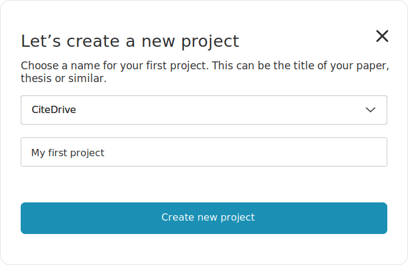
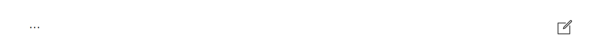

## Create a new project

After you log in, you will see all your projects in the dashboard overview. These are the ones you may have created or to which your colleagues have invited you.

:::tip Example projects
When you log in for the first time, we make three sample projects for you to play around with.
:::
To create a new project, click on the `+ Add new project`-button. A pop-up window should appear, looking like this:

There you enter a name for your project; this could be a paper or essay title. In our example, we name our project ``My first project.``

You choose the project type in the second step, with the standard "CiteDrive" being the typical use for most users.

:::info
We offer three project types; our standard CiteDrive, BibTeX, and R Markdown; these offer three different modes.
To differentiate:
Suppose you're using Microsoft Word, Google Docs, Apple Pages, OpenOffice, LibreOffice, or similar programs. In that case, the first one is for you.
If you work with LaTeX, then it is best to choose BibTeX.
If you work with Pandoc or R Markdown, choose R Markdown.
:::

With `Create new project`, when you are ready. We can now see in your new project in the overview. Click on the new project for more in the next step.

## Create new references

You can click on the big plus sign  in the panel on the right side to add new references. A pop-up window will appear. Define the type of your source, such as “Article in Journal” (paper / scientific publication), website, piece of music, etc., and enter all the data you need to cite.
Scroll down and click on the button when you have finished. We should have added a new table with further reference.

If you want to edit any reference, **hover** over the table and click on the edit icon.

## Organize references

You organize your references in tags that you can create on the left side - just click on the corresponding button. To add references to the tags, choose and click on the related references. On the right side, the panel will change with new options. At the top, you will see an icon with the number of selected references. Drag this icon to the tag.

## Create citations and bibliography

You can set the output language at the top of the navbar in which the app will generate your bibliography. To the right, you can select the style.
To cite:
1. Select one reference - or multiple if you want to refer to numerous sources to cluster into one.
2. Click on the citation icon, and it will generate the appropriate format for in-text citations.
3. You can now copy and paste it into your text document. For example Microsoft Word.

To generate your bibliography, click on `Create Bibliography` in the navbar, you will be redirected to a page with all sources in the correct style format.
