# Quick Start

We built CiteDrive from the ground up with a relentless focus on simplicity-- to be distraction-free and enable seamless reference management while staying out of your way. In less than 5 minutes, this quick start will walk you through every step of setting up a new project, collecting references, connecting your project to Overleaf and rendering a paper with bibliography and in-text citations.

## Create a Project

Once you’ve [signed up for a CiteDrive account](https://app.citedrive.com/sign-up), begin by creating your first project. CiteDrive supports a few flavors of projects including BibTex, Overleaf and R-Markdown, as well as a Standard project type. Choose the flavor that is best suited to where you ultimately intend to write and edit your paper.

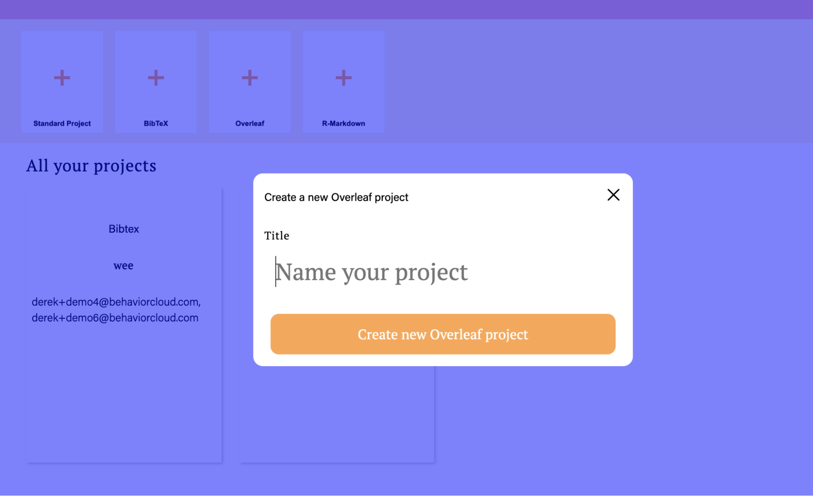

For the purposes of this quick start guide, create an Overleaf project and name it as you wish.

## Add References with CiteDrive Companion

One of the fastest and easiest ways to collect references for your CiteDrive project is to install the CiteDrive Companion browser extension from the [Chrome Web Store](https://chrome.google.com/webstore/detail/citedrive-companion/gmmonfphegngpcbcapfbgembkjeookik). With CiteDrive Companion, you can search and browse papers, books and more through your favorite indexes such as Google Scholar, Pubmed and many others. 

Install the CiteDrive Companion extension from the link above and open a new tab to [Google Scholar](https://scholar.google.com/). Do a search for a topic such as `data science` and click a paper of interest. As you identify references you’d like to include in your CiteDrive project, simply click the `+` button in the upper right corner of your screen:

A new window will then pop up to confirm the project to which you’d like to add the reference. Click Add Reference to confirm. The reference will now be added to your project.

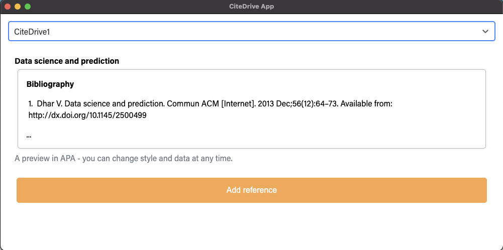

## Link your project to Overleaf

CiteDrive supports working with a number of different editors but we’ll quickly walk through a demonstration of how to link your CiteDrive project with Overleaf. Start by returning to your project and click the Export button toward the top of the screen:

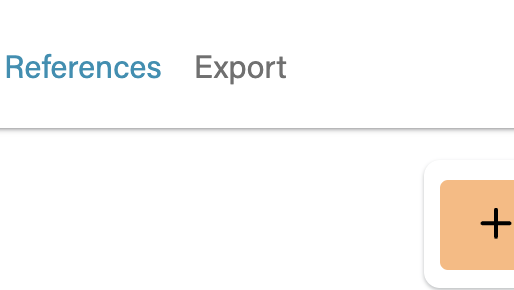

A new tab will be opened to a hosted references.bib file, similar to the one below:

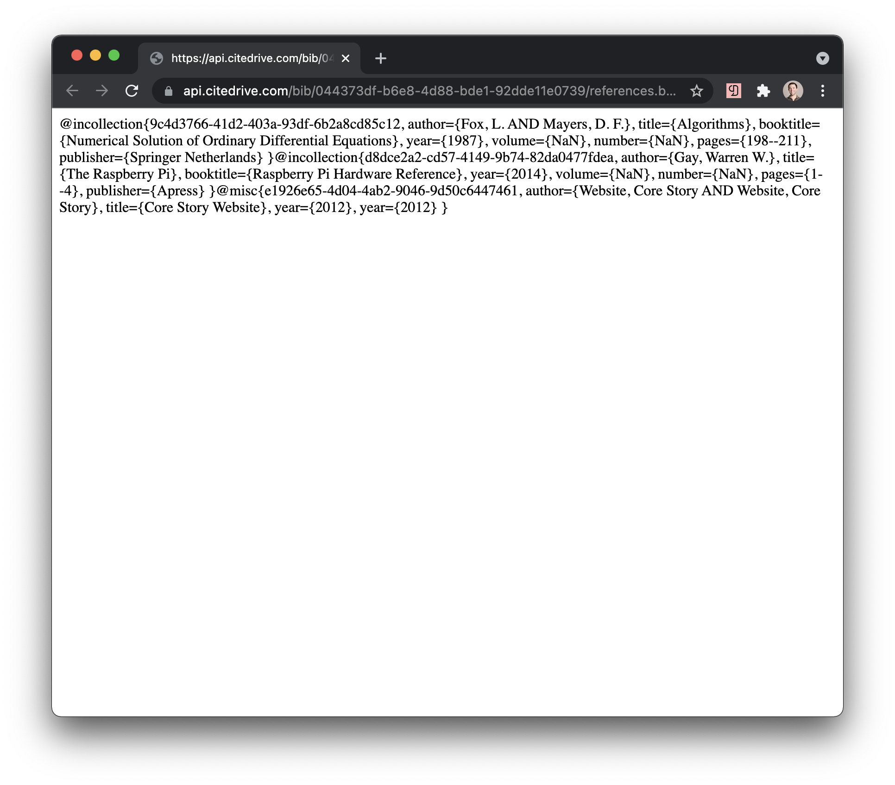

Select and copy the URL of this page and then return to your [Overleaf](https://www.overleaf.com/project) project. On the left-hand pane click the upload button:

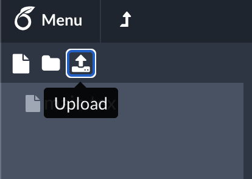

In the upload popup, select `From External URL`. Paste the URL from earlier in the top field and enter the name `references.bib` in the bottom field as shown below:

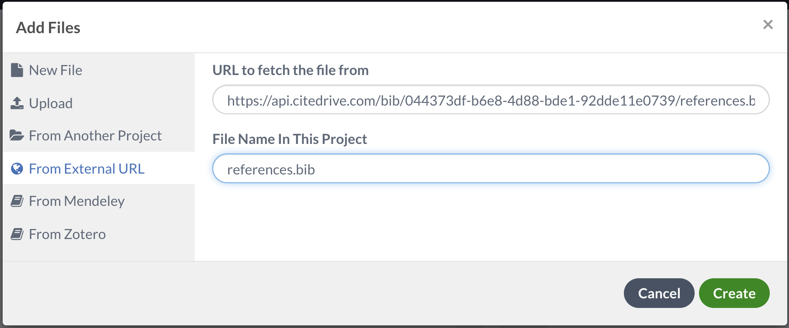

Click the Create button and note the new references.bib file on the left-hand side of the screen.

## Add a bibliography to your Overleaf project

Once you’ve linked your CiteDrive and Overleaf projects, we’ll next want to prepare our paper to include a bibliography. Open your main.tex file and add two tags near the top of the file:

`\usepackage[utf8]{inputenc}`
`\usepackage{apacite}`

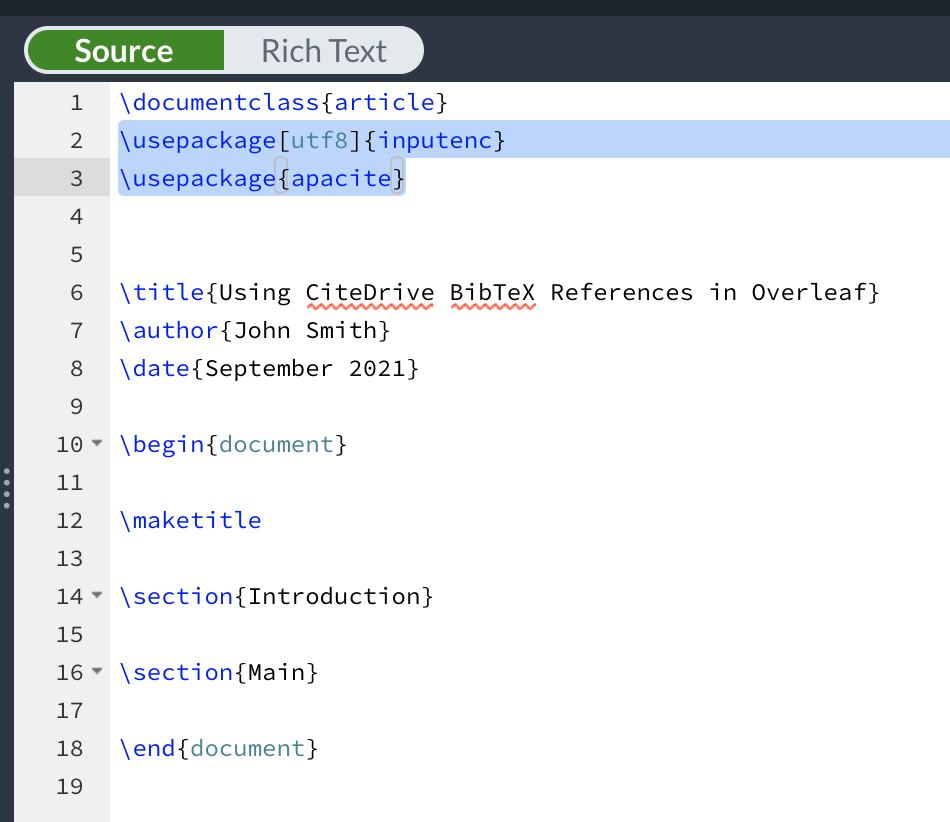

Similarly, add two more tags near the end of the file but before the ending document tag:

`\bibliographystyle{apacite}`
`\bibliography{references.bib}`

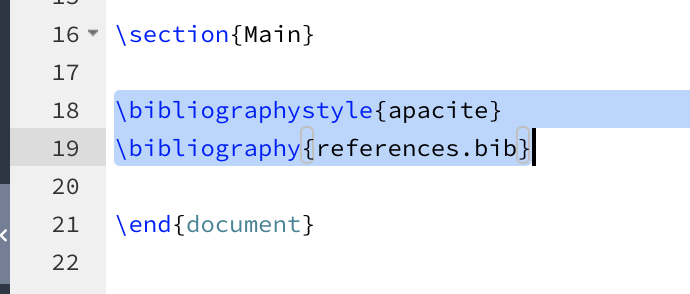

If you now re-render your paper, you should see an empty bibliography included:

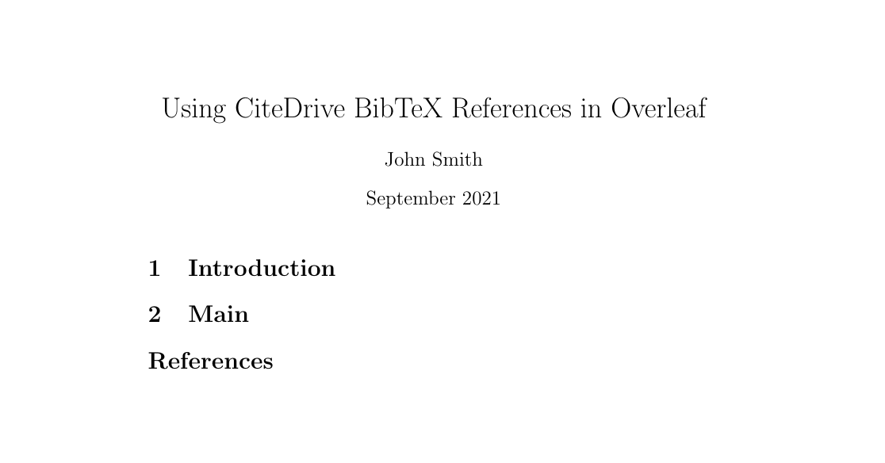

## Adding in-text citations to your paper

As the final step in our quick start, we’ll generate and add a couple in-text citations to our Overleaf project. Begin by drafting some text for a section of your paper:

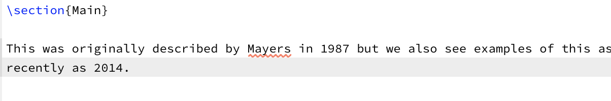

In CiteDrive, select a reference from your project and click the `In-text citation` button:

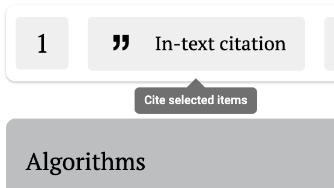

Proceed by clicking the Copy citation for BIBTEX button:

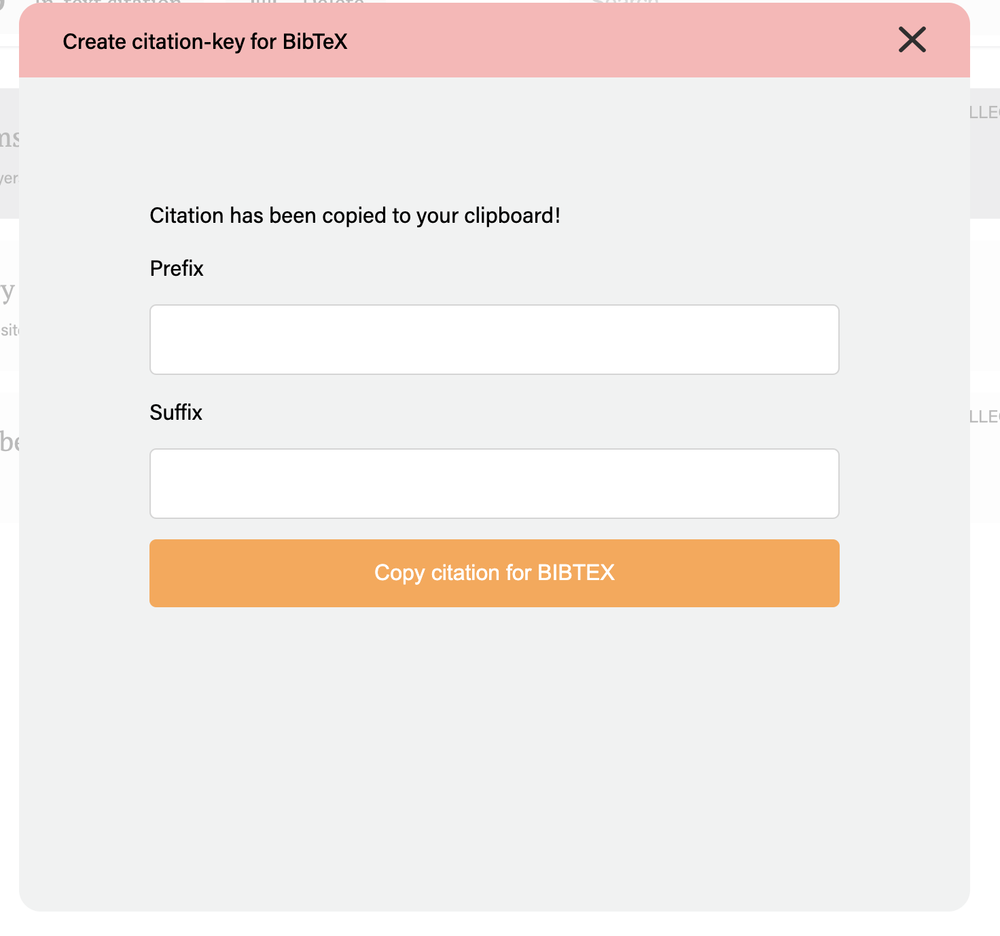

Return to your Overleaf project and paste this generated citation key into your paper in the appropriate place:

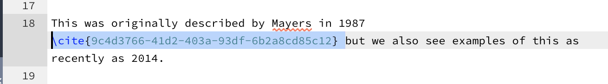

Repeat for your other reference and click the `Recompile` button in Overleaf to see the end result:

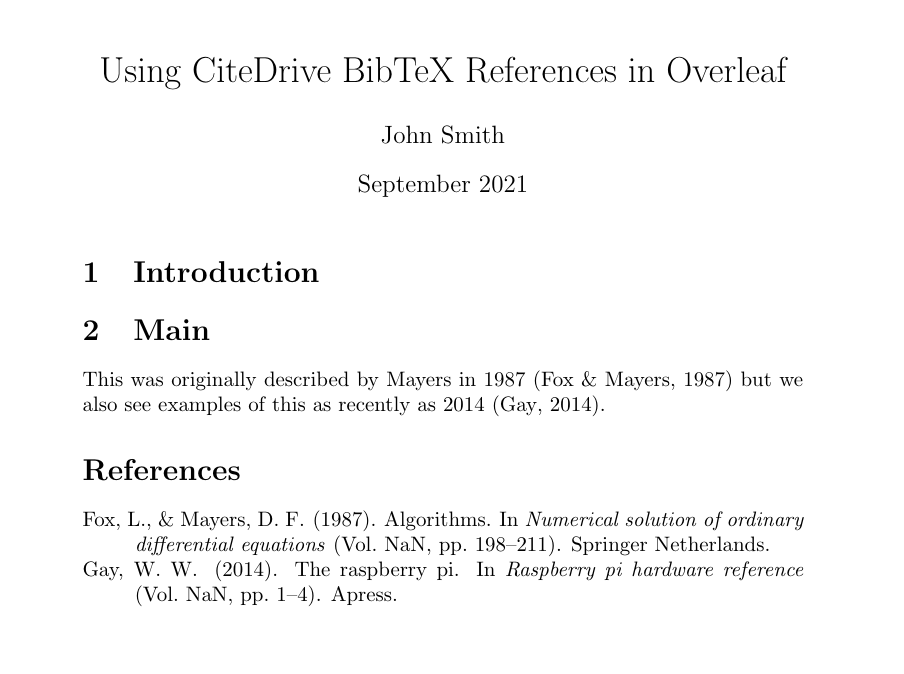
